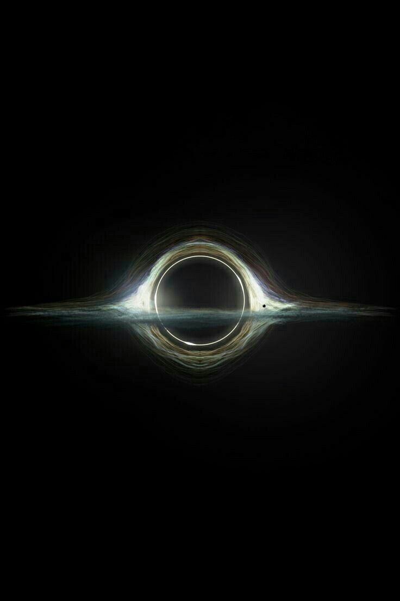

# yche0084_9103_tut8

## Part1 Imaging Technique Inspiration

This images all from Pinterest

The images respectively display the continuously flowing, shimmering black hole from the movie "Interstellar," and the use of foam to simulate the flowing state of the universe, conveying the vastness of the universe and the infinite variations of fate. Based on this theme, I would like to connect this concept with Pacita Abad's work "Wheels of fortune," to create an artwork composed of brightly colored, continuously flowing circles radiating outward from the center.

## Part2 Coding Technique Exploration

This code demonstrates how to use shaders in p5.js to create dynamic, interactive visual effects. It includes a shader function that sets the active shader to the one previously loaded. The setUniform function then passes multiple variables to the shader.This aligns perfectly with my design vision. It helps me achieve an art effect that is full of dynamism and visual distortion. The patterns in the image consist of many overlapping and flowing shapes that seem to continuously twist and turn, and each shape has unique color changes from bright, saturated colors to subdued tones. 

 The code was sourced from website (https://openprocessing.org/)
[Link Text](https://openprocessing.org/sketch/2247346)

